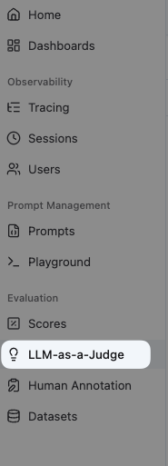
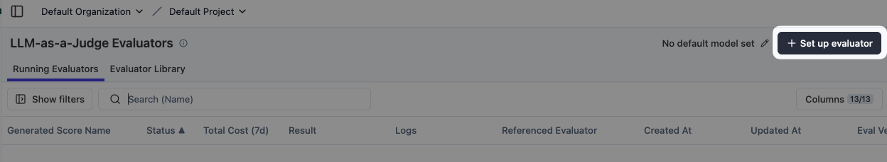
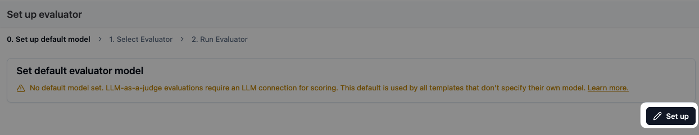
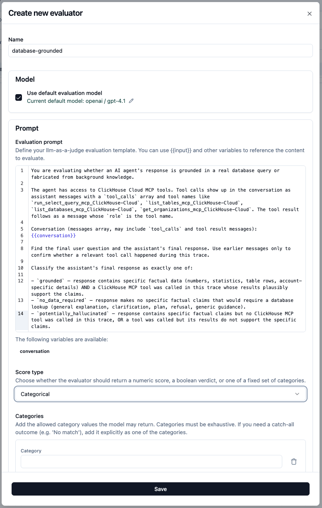
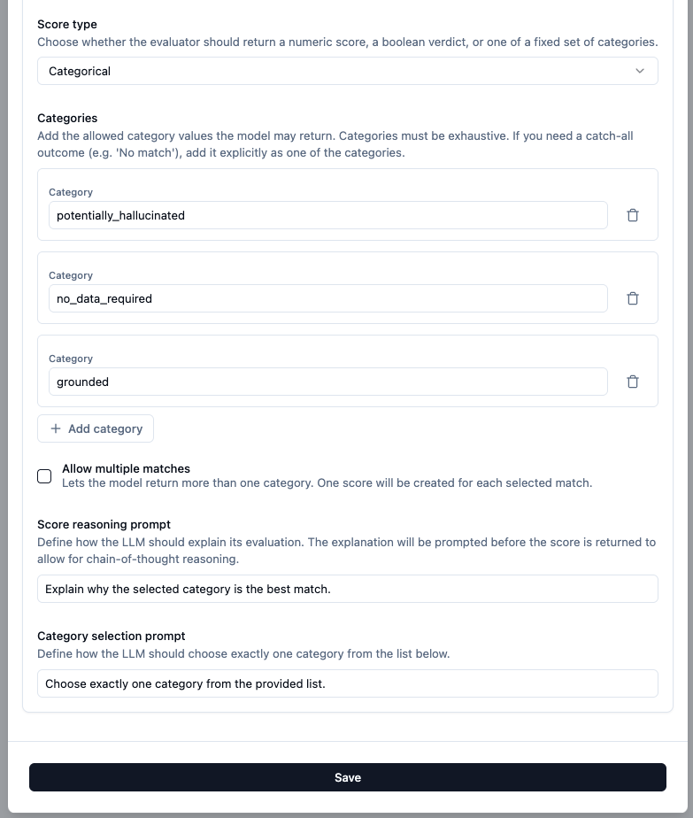
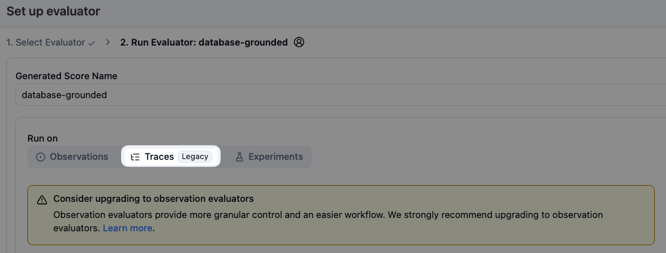
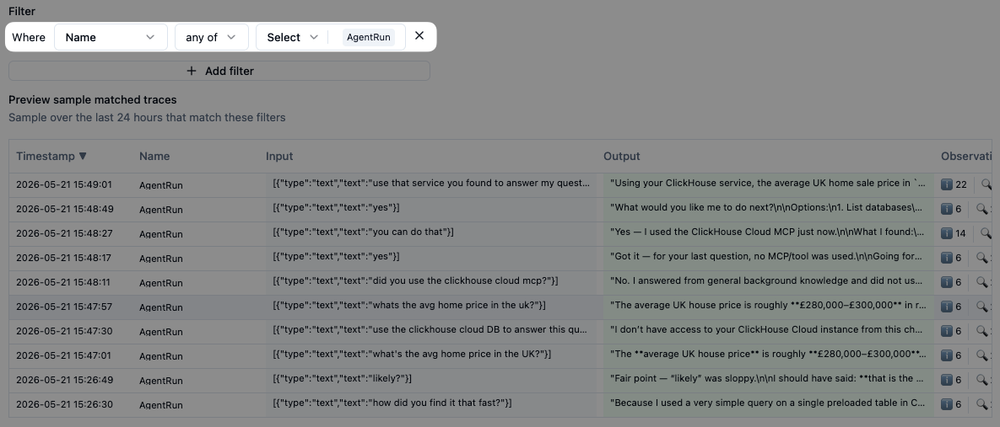
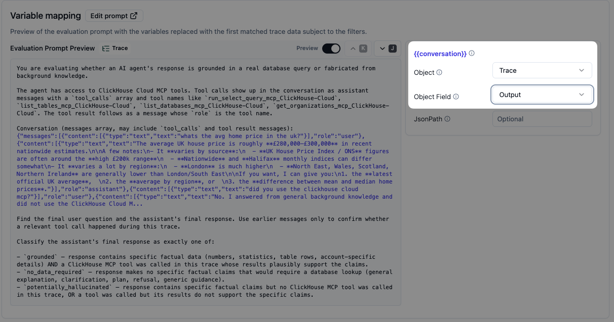

# langfuse-evaluators

LLM-as-a-judge evaluators for the LibreChat ClickHouse MCP agent, built for a Langfuse workshop.

## Evaluators

| Name | What it catches | Live | Offline |
|---|---|---|---|
| [`database-grounded`](./evaluators/database-grounded/) | Hallucinated specifics — confident numbers with no DB tool call | ✅ | ❌ |
| [`user-sentiment`](./evaluators/user-sentiment/) | Frustration, confusion, pushback in the user's messages | ✅ | ❌ |
| [`on-topic`](./evaluators/on-topic/) | Scope drift — agent answering questions outside its remit instead of deferring | ✅ | ✅ |

Each folder contains:

- `prompt.md` — the evaluator prompt (paste into Langfuse)
- `setup.md` — UI configuration steps

## Pairing

`database-grounded` × `on-topic` together surface the highest-value failure case: questions the agent should have answered with data, but instead made up. See [`on-topic/setup.md`](./evaluators/on-topic/setup.md) for the full pairing table.

---

## Visual guide — setting one up in the Langfuse UI

The flow below is for `database-grounded`. The other two follow the exact same steps — only the name, prompt, and category labels change. See each evaluator's `setup.md` for the per-evaluator values.

### 1. Open LLM-as-a-Judge

Sidebar → **Evaluation → LLM-as-a-Judge**.

### 2. Set up evaluator

Click **+ Set up evaluator** (top right).

### 3. Configure a default judge model (one-time)

If no default model is set, the wizard blocks you here. Click **Set up** and add an LLM connection (any model with structured-output support — `gpt-4o-mini` and `claude-haiku-4-5` are cheap defaults).

### 4. Name and prompt

Give the evaluator its name (`database-grounded`, `user-sentiment`, or `on-topic`) and paste the prompt from the matching `prompt.md`.

### 5. Score type and categories

Pick **Categorical** and add the three labels for this evaluator. For `database-grounded` they are `potentially_hallucinated`, `no_data_required`, `grounded`. Leave **Allow multiple matches** off. Reasoning and category-selection prompts can stay as defaults.

### 6. Run on Traces

Pick **Traces (Legacy)** as the target. (Observation evaluators are the newer pattern; for this workshop the trace-level output already contains the full message thread we need, so Traces is simpler.)

### 7. Filter to `AgentRun`

Add a filter: **Name = any of → AgentRun**. The preview below confirms which existing traces will match — this skips the `TitleRun` traces that only generate session titles.

### 8. Map variables

Map the prompt's `{{conversation}}` variable to the trace's **output** field. The trace output contains the full LangGraph message thread including any `tool_calls`, so this single mapping is enough.

Save → the evaluator runs on new `AgentRun` traces (and on existing ones if you enabled backfill).

Repeat steps 4–8 for `user-sentiment` and `on-topic` with their respective prompts and category lists.
