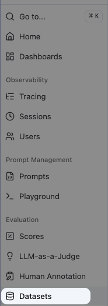
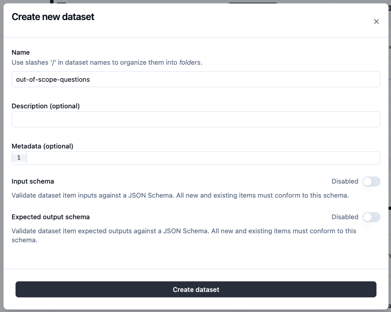
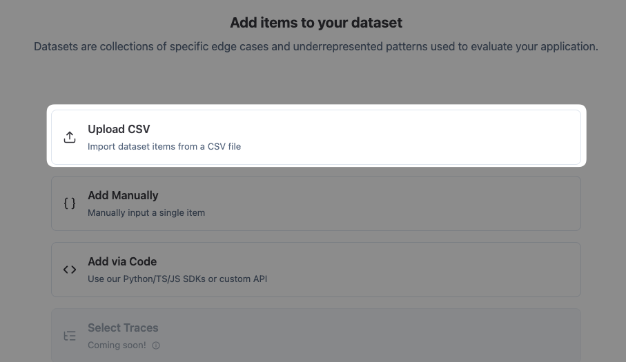
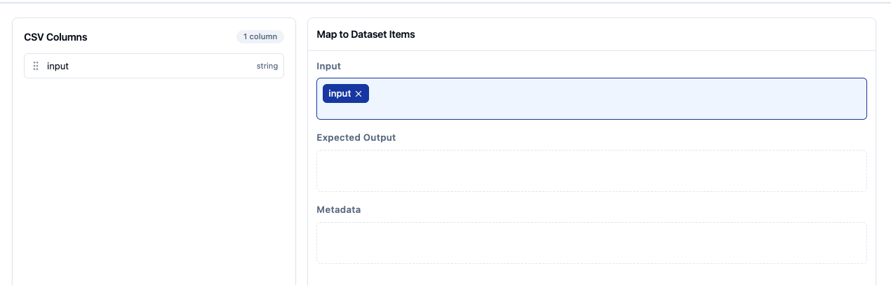

# Uploading a dataset to Langfuse

How to get [`out-of-scope-questions.csv`](./out-of-scope-questions.csv) (or any CSV in this folder) into Langfuse as a dataset, ready to run experiments against.

## 1. Open Datasets

Sidebar → **Evaluation → Datasets**.

## 2. New dataset

If this is the first dataset in the project, you'll see the empty state. Click **+ New dataset**.

## 3. Name it

- **Name:** `out-of-scope-questions`
- **Description / Metadata:** leave empty
- **Input schema / Expected output schema:** leave disabled — we're keeping this dataset simple

Click **Create dataset**.

## 4. Choose Upload CSV

The empty dataset gives you four ways to add items. Pick **Upload CSV**.

## 5. Map the column

Select [`out-of-scope-questions.csv`](./out-of-scope-questions.csv) from your filesystem. Langfuse detects the single column `input` and asks how to map it.

- **Input** → `input`
- **Expected Output** → leave empty (we don't have ground-truth answers; the `on-topic` evaluator decides "good" at experiment time)
- **Metadata** → leave empty

Confirm → 15 dataset items appear. Ready for experiments.

---

## What's next

Run an experiment against this dataset with the [`on-topic`](../evaluators/on-topic/) evaluator attached. Iterate the system prompt until every item scores `off_topic`. Then ship that prompt back to LibreChat.
