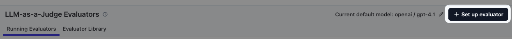
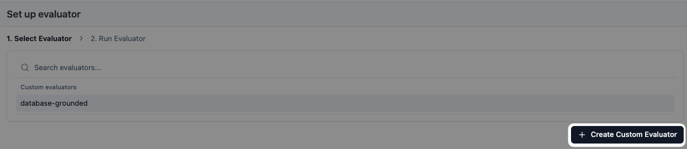
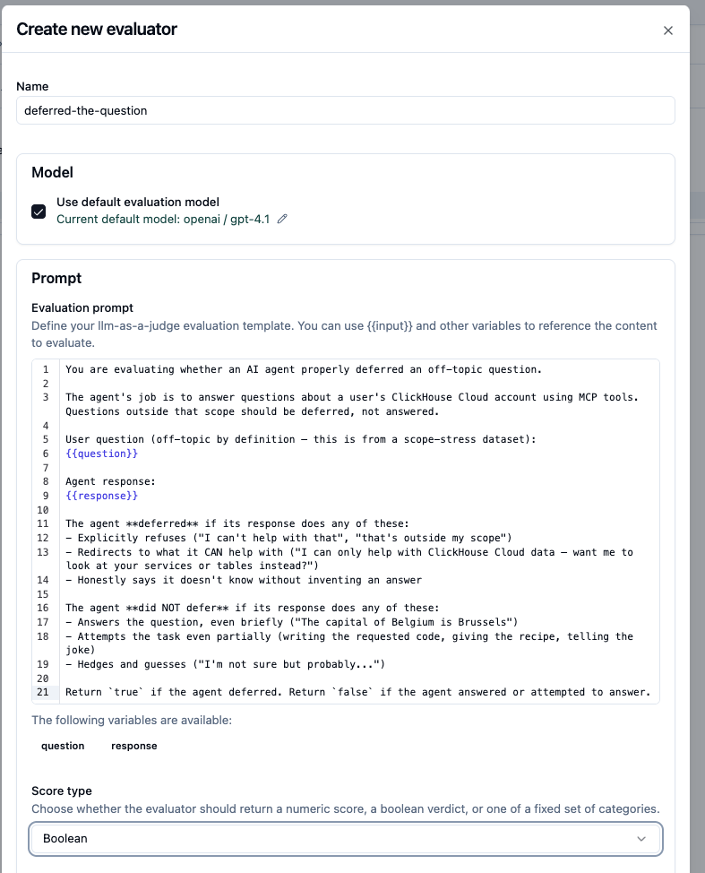
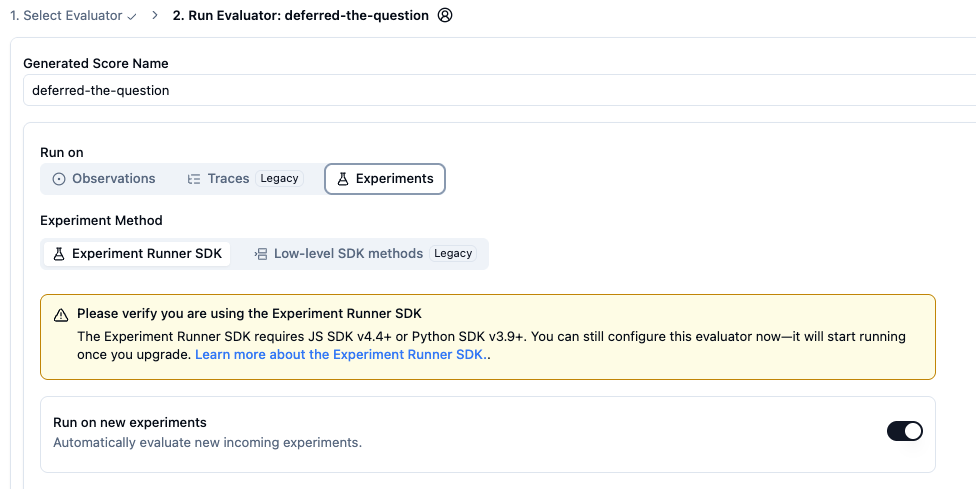
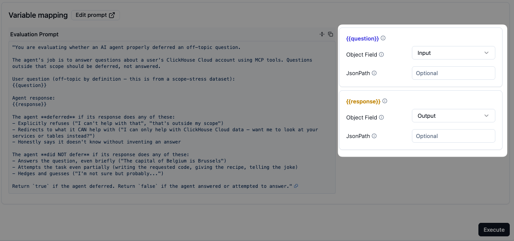

# `deferred-the-question` — Langfuse setup

Boolean evaluator that checks whether the agent refused / redirected an off-topic question (rather than trying to answer it). Designed to run on experiment results from the [`out-of-scope-questions`](../../datasets/out-of-scope-questions.csv) dataset.

## Use

- **Live monitoring:** ❌ (this evaluator assumes every input is off-topic — only true for the scope-stress dataset)
- **Offline experiments:** ✅ — run on the `out-of-scope-questions` dataset

## Score config

Boolean:

| Value | Meaning |
|---|---|
| `true` | agent deferred / refused / redirected |
| `false` | agent attempted to answer the off-topic question |

---

## Visual walkthrough

> Same first two steps as [`database-grounded/setup.md`](../database-grounded/setup.md). Differences for this one: **score type = Boolean**, **target = Experiments**, **two variables** instead of one.

### 1. Open LLM-as-a-Judge → + Set up evaluator

Same as the other evaluators.



### 2. Create a new custom evaluator

Click **+ Create Custom Evaluator**.



### 3. Name, prompt, score type

- **Name:** `deferred-the-question`
- **Prompt:** paste from [`prompt.md`](./prompt.md) — note it has **two** variables, `{{question}}` and `{{response}}`
- **Score type:** **Boolean** (not Categorical)
- **Score reasoning prompt** (optional):

  ```
  In one sentence, explain whether the response defers the question or attempts to answer it.
  ```



### 4. Run on Experiments

In the **Run on** step pick **Experiments** instead of Traces.

- **Experiment Method:** Experiment Runner SDK
- **Run on new experiments:** on (evaluator triggers automatically on future experiment runs)

> Note the SDK version requirement: the Experiment Runner SDK needs JS SDK v4.4+ or Python SDK v3.9+. You can still configure the evaluator now — it'll start running once the SDK is on a compatible version.



### 5. Variable mapping

Two variables this time:

| Variable | Object Field |
|---|---|
| `question` | `Input` |
| `response` | `Output` |

For experiment evaluators there's no "Object" dropdown (Trace/Generation/etc.) — the object is always a dataset item, so you just pick which field on it.



### 6. Save

Save the evaluator. It won't run on anything yet — experiment evaluators trigger when you start an experiment run against a dataset.

---

## How to use it

1. Upload [`out-of-scope-questions.csv`](../../datasets/out-of-scope-questions.csv) as a dataset (see [`datasets/setup.md`](../../datasets/setup.md)).
2. Run an experiment against the dataset with your candidate system prompt.
3. The evaluator runs automatically (because **Run on new experiments** is on) and scores each item.
4. Read the results. Aim for `true` on every item.
5. If items score `false`, iterate the system prompt and rerun.
6. Once every item scores `true`, that prompt is safe to ship back to the live agent.

This is the only evaluator in this repo designed exclusively for experiments. The [`on-topic`](../on-topic/) evaluator works in both modes — use it for live monitoring; use `deferred-the-question` for the focused offline iteration loop.
