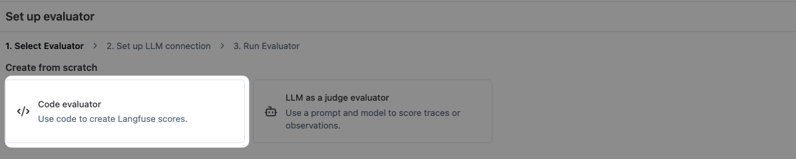
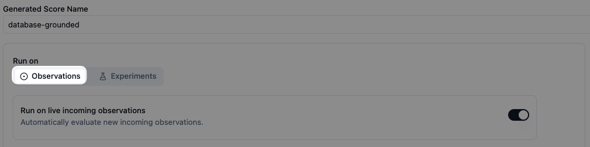
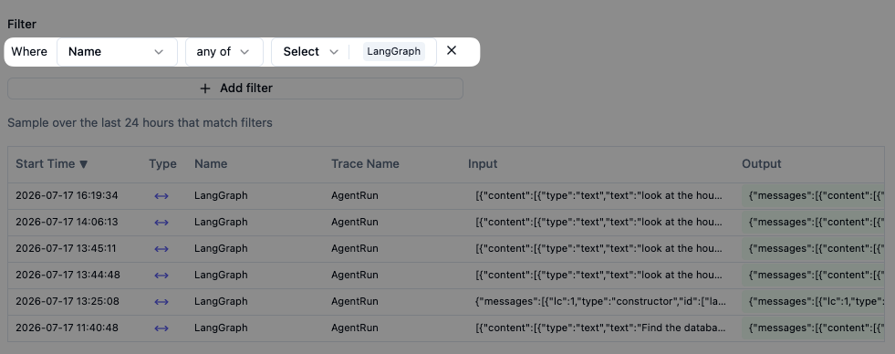

# `database-grounded` (code evaluator) — Langfuse setup

A deterministic, code-based version of the [`database-grounded`](../database-grounded/) LLM judge. "Did the agent actually query the database?" is a structural fact — on the current trace structure each tool call is recorded — so a few lines of Python answer it more reliably (and for free) than a model can.

## Code vs LLM judge

| | [`database-grounded`](../database-grounded/) (LLM) | `database-grounded` (code) |
|---|---|---|
| Answers | "grounded / no_data_required / potentially_hallucinated" via semantic judgment | "grounded / metadata_only / no_tool_call" via tool-call inspection |
| Cost / latency | model call per trace | free, milliseconds |
| Deterministic | no | yes |
| Catches "answered a data question from stale context without re-querying" | unreliable (sees the whole thread) | **yes** — scopes to the current turn |
| Judges whether the prose's numbers actually match the returned rows | yes (semantic) | no |

Run them side by side: the code evaluator gives the deterministic "was the DB queried this turn" signal; keep the LLM judge if you also want the semantic "are the stated numbers supported" check.

## Use

- **Live monitoring:** ✅
- **Offline experiments:** ✅ (code evaluators run on experiment observations too)
- **Requirements:** OTel-based SDK (LibreChat is on JS SDK v5 ✅). On **self-hosted** Langfuse, code evaluators need a configured [code-evaluator dispatcher](https://langfuse.com/self-hosting/configuration/code-evaluators); on Langfuse Cloud it's built in.

## Visual walkthrough

### 1. Set up evaluator → Code evaluator

Sidebar → **Evaluation → Evaluators → + Set up evaluator**. Under **Create from scratch**, pick **Code evaluator** (not LLM as a judge).

### 2. Name and code

- **Name:** `database-grounded`
- **Type:** `Python`
- **Code:** paste from [`evaluator.py`](./evaluator.py)

The evaluator finds the **last `user` message** and inspects only the messages after it — the current run. Earlier turns' tool calls are conversation history and are ignored, so a turn that answered from context isn't credited with an earlier turn's query. It returns a categorical score: `grounded` (a `run_select_query` ran this turn), `metadata_only` (only schema/listing tools ran), or `no_tool_call` (nothing ran — answered from history/background knowledge).

### 3. Run on Observations

Pick **Observations** and leave **Run on live incoming observations** on.

### 4. Filter to the `LangGraph` span

- Filter: **Name = any of → `LangGraph`**

Same target as the LLM judge — the `LangGraph` span's `output` is the full message thread the code parses. One span per `AgentRun` trace, so one score per trace.

### 5. Test before saving

Use **Test** to run the evaluator against a sampled matching observation and confirm the score. The preview shows the `ctx` the code receives — note `toolCalls` is an empty list here, which is why the code parses `observation.output` (the message thread) rather than relying on `ctx.observation.tool_calls`.

Save → the evaluator scores the `LangGraph` span of every new `AgentRun` trace.

---

## Why parse the thread instead of `ctx.observation.tool_calls`

`ctx.observation.tool_calls` reflects calls recorded directly on the target observation — for the `LangGraph` span that's empty (see the test preview). The tool calls live inside the span's `output` message thread: assistant messages carry a `tool_calls` array, and each tool result is a message whose `role` is the tool name (e.g. `run_select_query_mcp_ClickHouse-Cloud`). Parsing the thread — scoped to the current turn — is the reliable source.
