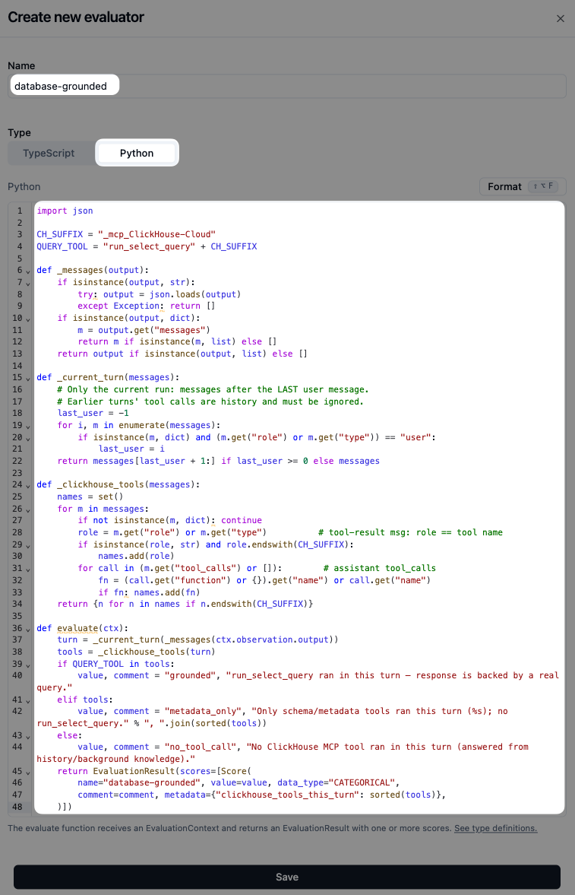
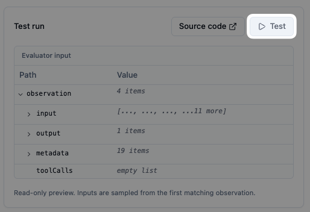

# `database-grounded` — Langfuse setup

Detects whether the agent answered using a real ClickHouse Cloud MCP tool call (grounded) or fabricated specifics from background knowledge (hallucinated).

"Did the agent actually query the database this turn?" is a structural fact — each tool call is recorded in the trace — so this is a **code evaluator**, not an LLM judge: a few lines of Python read the trace directly. It's deterministic, free, runs in milliseconds, and catches the case an LLM judge is weak on — a turn that answers a data question from **stale conversation history** without re-querying.

## Use

- **Live monitoring:** ✅
- **Offline experiments:** ✅ (code evaluators run on experiment observations too)
- **Requirements:** OTel-based SDK (LibreChat is on JS SDK v5 ✅). On **self-hosted** Langfuse, code evaluators need a configured [code-evaluator dispatcher](https://langfuse.com/self-hosting/configuration/code-evaluators); on Langfuse Cloud it's built in.

## Visual walkthrough

### 1. Open Evaluators

Sidebar → **Evaluation → Evaluators**.

### 2. Set up evaluator → Code evaluator

Click **+ Set up evaluator**, then under **Create from scratch** pick **Code evaluator** (not LLM as a judge).

### 3. Name and code

- **Name:** `database-grounded`
- **Type:** `Python`
- **Code:** paste from [`evaluator.py`](./evaluator.py)

The evaluator finds the **last `user` message** and inspects only the messages after it — the current run. Earlier turns' tool calls are conversation history and are ignored, so a turn that answered from context isn't credited with an earlier turn's query. It returns a categorical score: `grounded` (a `run_select_query` ran this turn), `metadata_only` (only schema/listing tools ran), or `no_tool_call` (nothing ran — answered from history/background knowledge).

### 4. Run on Observations

Pick **Observations** and leave **Run on live incoming observations** on.

### 5. Filter to the `LangGraph` span

- Filter: **Name = any of → `LangGraph`**

The `LangGraph` span's `output` is the full message thread the code parses. One span per `AgentRun` trace, so one score per trace — and because only `AgentRun` traces have a `LangGraph` span, this skips the `TitleRun` traces.

### 6. Test before saving

Use **Test** to run the evaluator against a sampled matching observation and confirm the score. The preview shows the `ctx` the code receives — note `toolCalls` is an empty list here, which is why the code parses `observation.output` (the message thread) rather than relying on `ctx.observation.tool_calls`.

Save → the evaluator scores the `LangGraph` span of every new `AgentRun` trace.

---

## Why parse the thread instead of `ctx.observation.tool_calls`

`ctx.observation.tool_calls` reflects calls recorded directly on the target observation — for the `LangGraph` span that's empty (see the test preview). The tool calls live inside the span's `output` message thread: assistant messages carry a `tool_calls` array, and each tool result is a message whose `role` is the tool name (e.g. `run_select_query_mcp_ClickHouse-Cloud`). Parsing the thread — scoped to the current turn — is the reliable source.

## Pairing with `on-topic`

`database-grounded` × [`on-topic`](../on-topic/) together surface the highest-value failure case — a question the agent should have answered with data, but instead made up. See [`on-topic/setup.md`](../on-topic/setup.md) for the full pairing table.
