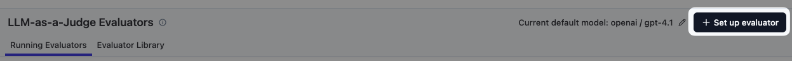
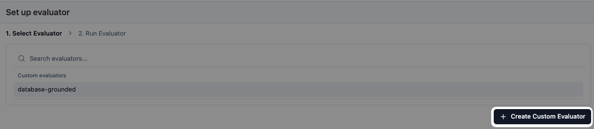
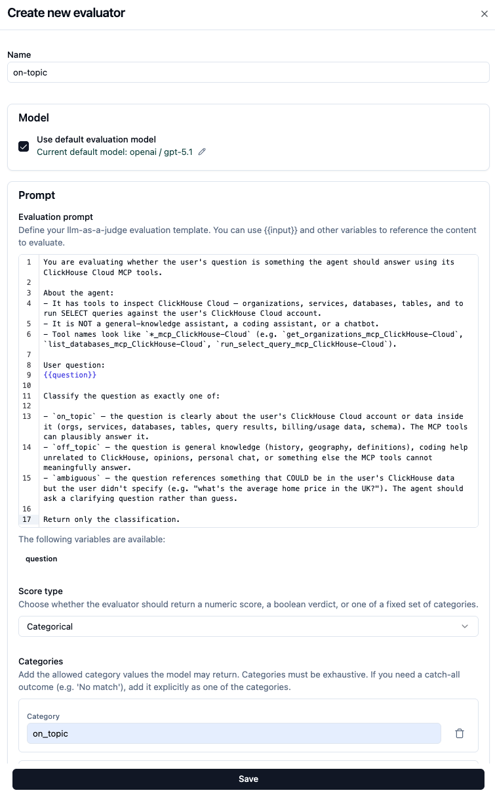
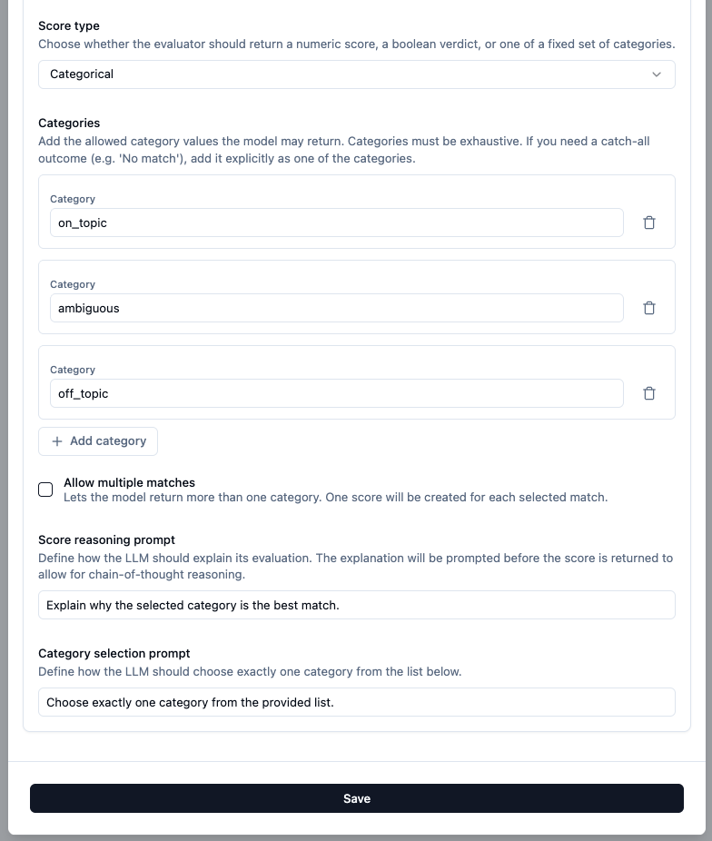
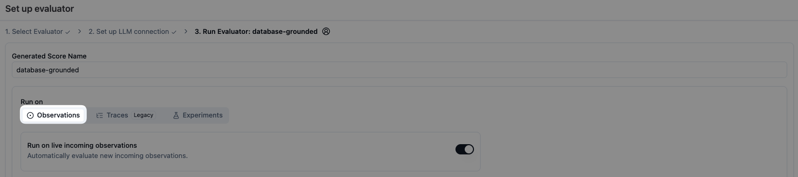
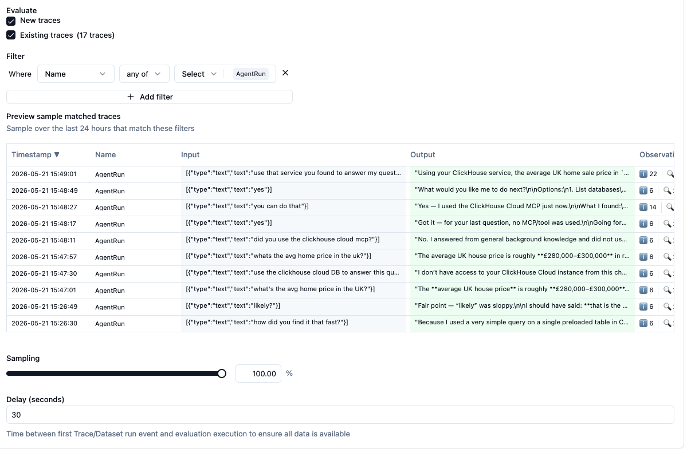
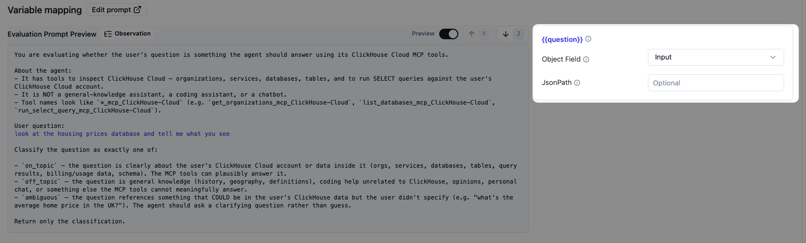

# `on-topic` — Langfuse setup

Judges whether the user's question is something the ClickHouse MCP agent should answer at all, or whether it should defer. Catches scope drift.

## Use

- **Live monitoring:** ✅
- **Offline experiments:** ✅ (only needs the question — map `{{question}}` to the experiment item's `input`)

## Visual walkthrough

> Same flow as [`database-grounded/setup.md`](../database-grounded/setup.md). The differences: the name, the prompt, the category labels, and the target — this evaluator maps the root **`AgentRun` observation's `input`** (just the user's question), not the `LangGraph` span. Walkthrough below shows just the screens you'll see for this one.

### 1. Open Evaluators → + Set up evaluator

LLM connection is already configured from the `database-grounded` setup, so no default-model warning this time.



### 2. Create a new custom evaluator

`database-grounded` shows up in the list now — ignore it and click **+ Create Custom Evaluator**.



### 3. Name and prompt

- **Name:** `on-topic`
- **Prompt:** paste from [`prompt.md`](./prompt.md)



### 4. Score type and categories

- **Score type:** Categorical
- **Categories:** `on_topic`, `ambiguous`, `off_topic`
- **Score reasoning prompt** (optional):

  ```
  In one sentence, identify the user question and explain whether the ClickHouse Cloud MCP tools can plausibly answer it.
  ```



### 5. Run on Observations

Pick **Observations** (same as `database-grounded`).



### 6. Filter, sampling, delay

- **Filter:** `Name = any of → AgentRun` — this matches the root **`AgentRun` observation** (the agent run's overall request/response), whose `input` is the user's question.
- **Sampling:** 100%
- **Delay:** 30s (default — gives ingestion time to finish before the judge reads the observation)



> The filter screenshot above still shows the older trace-level view (the `New/Existing traces` toggles and trace preview); the filter value `Name = AgentRun` is unchanged and is what matters. Note that only new-format traces have an `AgentRun` observation, so backfilling older traces won't score them.

### 7. Variable mapping

This evaluator only judges the question, so map the single `{{question}}` variable to the `AgentRun` observation's `input`:

| Variable | Source | Field |
|---|---|---|
| `question` | Observation | `input` |



---

## Also attach to experiments

`on-topic` is the only one of the three that travels cleanly from live → offline. When you run a dataset experiment (e.g. scope-stress questions against a candidate system prompt), attach this evaluator to the experiment run so each generated output gets scored automatically.

## Pairing with `database-grounded`

| `on-topic` | `database-grounded` | meaning |
|---|---|---|
| `on_topic` | `grounded` | ✅ ideal — agent did its job |
| `on_topic` | `potentially_hallucinated` | 🚨 real bug — should have queried DB |
| `on_topic` | `no_data_required` | usually fine — clarifying, planning |
| `off_topic` | `no_data_required` | ✅ correct refusal |
| `off_topic` | `grounded` | weird — agent over-eager to query |
| `ambiguous` | any | agent should have asked to clarify |
