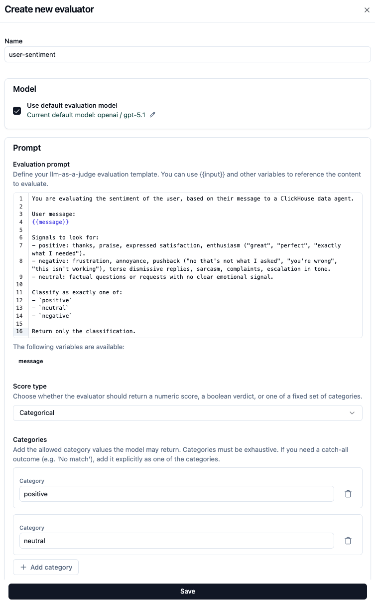
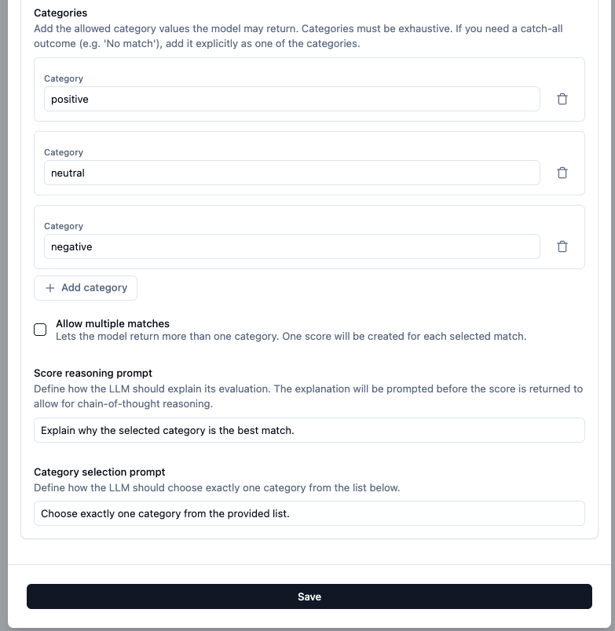
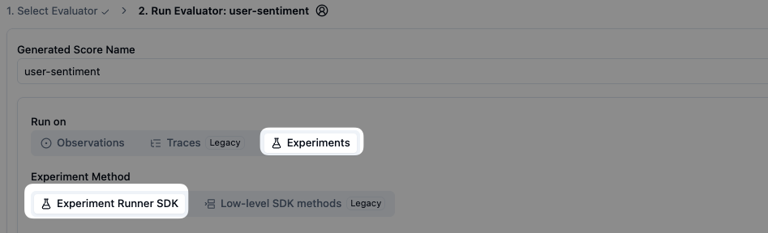
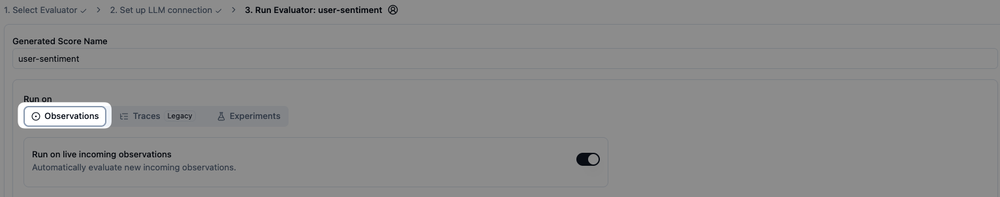
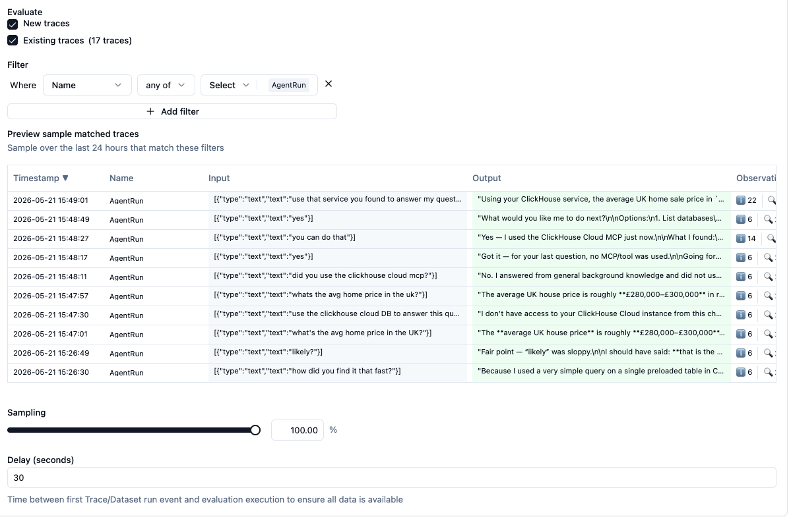
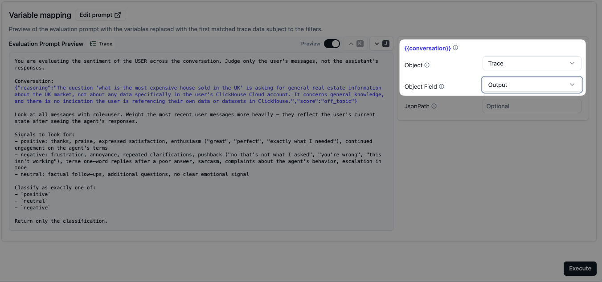

# `user-sentiment` — Langfuse setup

Reads the user's messages and labels their emotional state. Catches frustration and confusion that wouldn't show up in correctness metrics.

## Use

- **Live monitoring:** ✅
- **Offline experiments:** ❌ (no real user means no sentiment signal)

## Visual walkthrough

> Same 8 steps as [`database-grounded/setup.md`](../database-grounded/setup.md). Only the name, prompt, and category labels change. Walkthrough below shows just the screens you'll see for this one.

### 1. Open LLM-as-a-Judge → + Set up evaluator


### 2. Create a new custom evaluator

`database-grounded` is in the list now — click **+ Create Custom Evaluator** to add this one.


### 3. Name and prompt

- **Name:** `user-sentiment`
- **Prompt:** paste from [`prompt.md`](./prompt.md)



### 4. Score type and categories

- **Score type:** Categorical
- **Categories:** `positive`, `neutral`, `negative`
- **Score reasoning prompt** (optional):

  ```
  In one sentence, point to the strongest sentiment signal in the user's messages.
  ```



### 5. Skip Experiments — pick Traces

The wizard offers **Experiments** as a target. **Skip it for this evaluator.** An experiment has no real user reacting — there's no sentiment to score.



### 6. Run on Traces

**Traces (Legacy)**, **New traces** + **Existing traces** both checked.



### 7. Filter, sampling, delay

- **Filter:** `Name = any of → AgentRun`
- **Sampling:** 100%
- **Delay:** 30s (default)



### 8. Variable mapping

| Variable | Source | Field |
|---|---|---|
| `conversation` | Trace | `output` |

The Langfuse UI also shows a live preview of the prompt with one matched trace's data filled in — useful sanity check before saving.



---

## Note on multi-turn traces

The trace `output` contains the full session-to-date message thread. Every `AgentRun` in a session re-scores sentiment across all earlier turns — usually what you want (sentiment trend per session). To score only the latest user turn, change the prompt to "judge only the FINAL user message."
