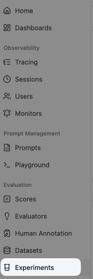
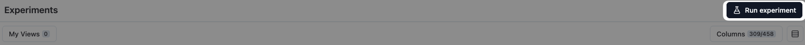
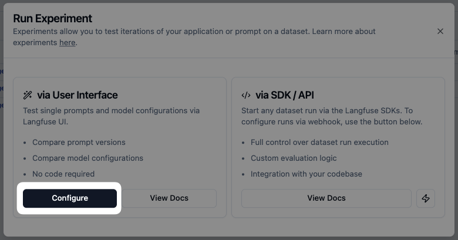
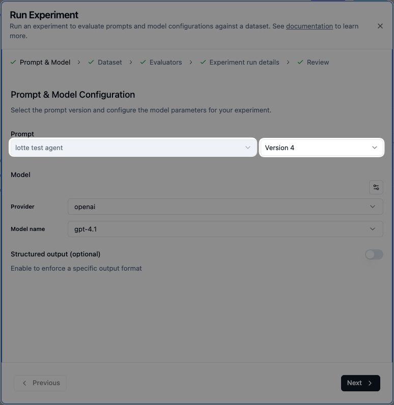
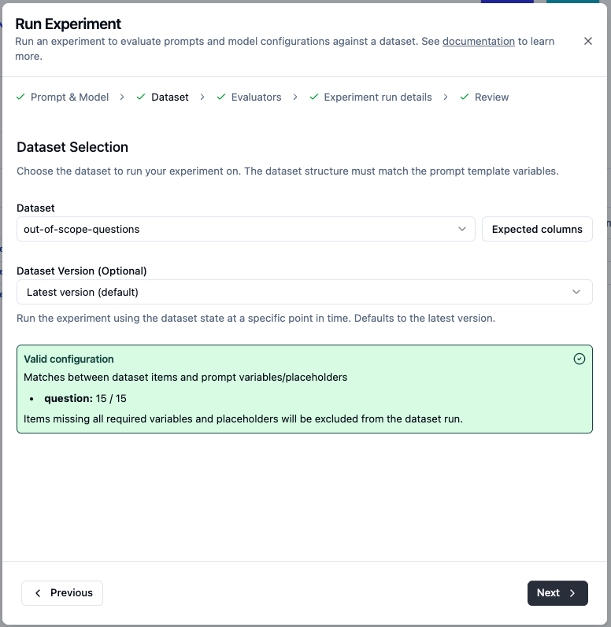
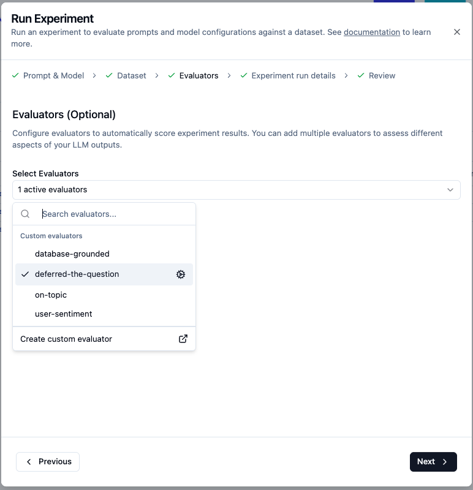
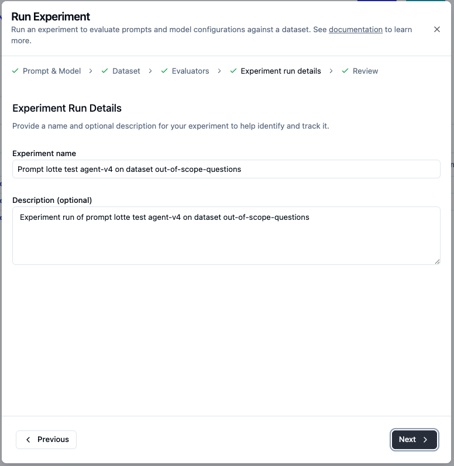
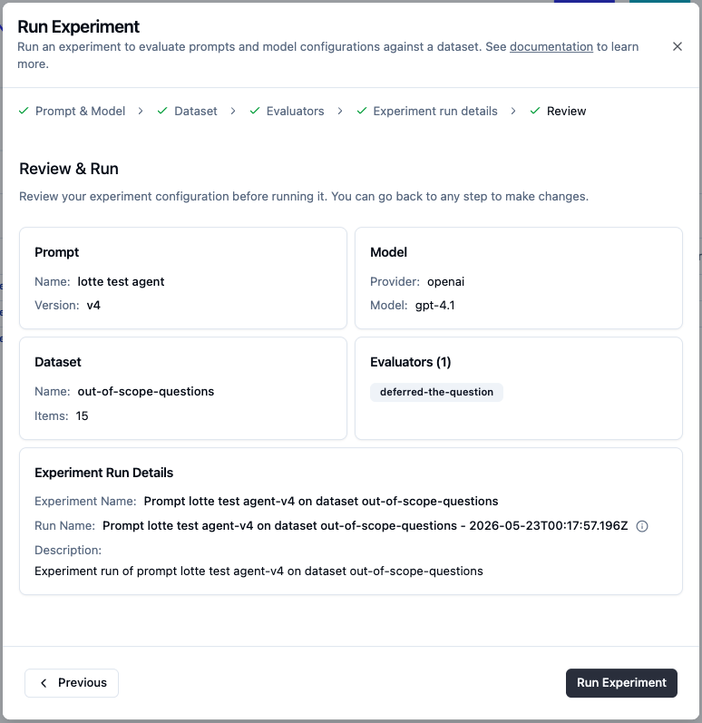
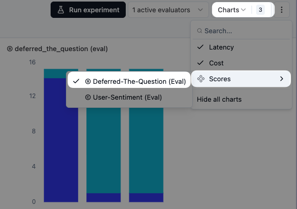

# Running the offline experiment

How to run an experiment in Langfuse against the [`out-of-scope-questions`](../datasets/out-of-scope-questions.csv) dataset and read the resulting scores chart.

Prerequisites:

- [`out-of-scope-questions`](../datasets/setup.md) dataset uploaded
- The agent's system prompt saved in Langfuse Prompts (so it can be selected by name and version). For a simple starting point, the prompt can just contain `{{conversation}}` as its only variable — the dataset item's input fills it in at run time.

## 1. Set up the evaluator

Create the `deferred-the-question` evaluator (boolean, target: Experiments). Full walkthrough in [`deferred-the-question/setup.md`](./deferred-the-question/setup.md). Come back here once it's saved.

## 2. Open the dataset

Sidebar → **Evaluation → Datasets** → click `out-of-scope-questions`.

## 3. Run experiment

Top right of the dataset page → **Run experiment**.

## 4. Pick UI mode

Two ways to run: **via User Interface** (no code, prompt + model from the Langfuse registry) or **via SDK / API** (full control, custom logic). For the workshop pick **via User Interface → Configure**.

## 5. Prompt & Model

- **Prompt:** select the system prompt by name (e.g. `lotte test agent`) and version
- **Model:** provider + model name (e.g. openai / gpt-4.1)
- Structured output: leave off

Each prompt iteration is just a new **Version** of the same prompt — that's what lets you compare runs in the next steps.

## 6. Dataset

- **Dataset:** `out-of-scope-questions`
- **Dataset Version:** Latest version (default)

Langfuse validates that the prompt's `{{variables}}` match dataset columns. With this dataset's single `input` column mapped to the prompt's `question` variable, you should see **Valid configuration → question: 15 / 15**.

## 7. Evaluators

Open the dropdown and tick **`deferred-the-question`**. Leave the others unticked — they're configured as live-trace evaluators and aren't relevant to the offline scope-stress test.

## 8. Experiment run details

The defaults are good. Langfuse auto-fills the name with prompt version + dataset name so you can tell runs apart later.

## 9. Review & run

Final check of prompt version, model, dataset, and attached evaluator. Click **Run Experiment**.

The experiment generates one trace per dataset item (15 here). The `deferred-the-question` evaluator runs on each one automatically and writes a boolean score.

## 10. Read the scores chart

Back on the dataset page → **Charts** (top right) → **Scores → Deferred-The-Question (Eval)**.

You get a stacked bar per experiment run showing how many items scored `true` vs `false`. Use this to compare iterations side by side — v1 vs v2 vs v3 of the prompt.

---

## The iteration loop

1. Run an experiment with the current prompt version.
2. Look at the chart. Aim for `true` on all 15.
3. If any items scored `false`, open the run and read those traces — see what the agent said instead of deferring.
4. Edit the prompt, save it as a new Version.
5. Run experiment again, picking the new version.
6. Compare bars in the chart.
7. Once every item scores `true`, that prompt version is ready to ship back to LibreChat.
